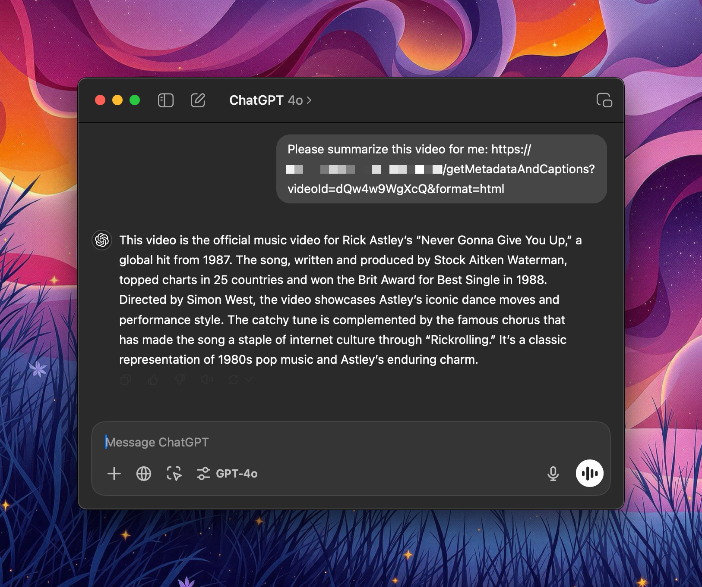
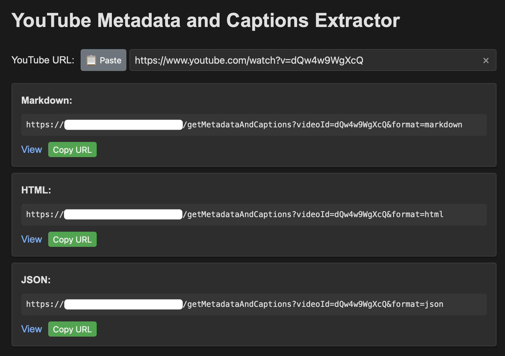
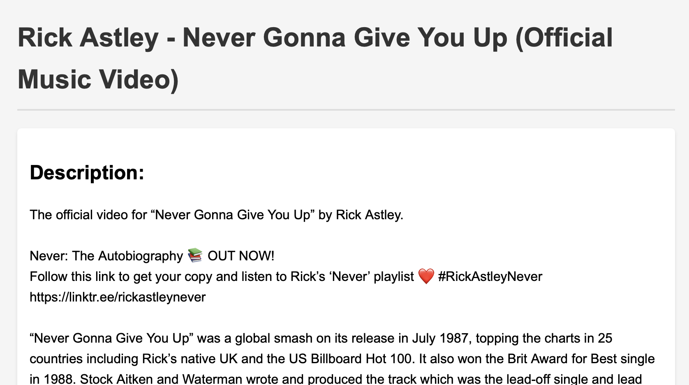

# YouTube Metadata and Captions Extractor

A simple web service that extracts metadata and captions from YouTube videos, with support for multiple output formats. Serves an index page with a form to input a YouTube URL.

This tool was created to allow ChatGPT to "see" YouTube videos. ChatGPT's web tool can't access YouTube videos directly. Also note that ChatGPT's web tool can only access pages with a `text/html` content type, so if you're planning to ask ChatGPT to browse to the URL, use HTML. Alternatively, you can grab the markdown and paste it into ChatGPT. This is sometimes more reliable.

You would, of course, need to deploy this service to a server that can be accessed by ChatGPT.

*Use in ChatGPT*


*Link Generator*


*HTML Output*


## Features

- 🎯 Extract video metadata and captions from any YouTube video
- 📝 Multiple output formats:
  - HTML (styled, default)
  - Markdown
  - JSON
- 🎨 UI with:
  - Live URL validation
  - One-click clipboard operations

## Metadata Extracted

- Title
- Description
- Author
- Upload Date
- View Count
- Duration
- Captions (English)

## Installation

1. Clone the repository:
   ```bash
   git clone https://github.com/acehoss/yt-to-html.git
   cd yt-to-html
   ```

2. Install dependencies:
   ```bash
   npm install
   ```

3. Build the TypeScript code:
   ```bash
   npm run build
   ```

4. Start the server:
   ```bash
   npm start
   ```

   For development with hot reload:
   ```bash
   npm run dev
   ```

The service will be available at `http://localhost:3001`

## Usage

1. Open the web interface in your browser
2. Paste a YouTube URL (supports various formats)
3. Get instant access to three format options:
   - HTML: Slightly styled presentation (default)
   - Markdown: Great for documentation
   - JSON: Perfect for API integration

### API Endpoints

#### GET /getMetadataAndCaptions

Extracts metadata and captions from a YouTube video.

Parameters:
- `videoId` (required): YouTube video ID
- `format` (optional): Output format (`markdown`, `html`, or `json`, defaults to `html`)

Example:
```bash
curl "http://localhost:3001/getMetadataAndCaptions?videoId=dQw4w9WgXcQ"  # Returns HTML by default
curl "http://localhost:3001/getMetadataAndCaptions?videoId=dQw4w9WgXcQ&format=markdown"  # Returns markdown
```

## Nginx Configuration

To serve behind a reverse proxy, use this Nginx configuration:

```nginx
location /yt/ {
    rewrite ^/yt/(.*) /$1 break;
    proxy_pass http://localhost:3001;
    proxy_http_version 1.1;
    proxy_set_header Upgrade $http_upgrade;
    proxy_set_header Connection 'upgrade';
    proxy_set_header Host $host;
    proxy_cache_bypass $http_upgrade;
}
```

## Development

The project uses:
- TypeScript for type safety
- Express.js for the web server
- YouTube.js (youtubei.js) for YouTube interaction
- Built-in transcript support (no XML parsing needed)

### Available Scripts

- `npm run dev` - Start development server with hot reload
- `npm run build` - Build TypeScript to JavaScript
- `npm start` - Run production server
- `npm run typecheck` - Run TypeScript type checking

To modify the theme, edit the CSS variables in `src/index.ts`.

## Running as a System Service

To run this application as a system service on Linux, you can use systemd. Here's a sample service unit file:

### `/etc/systemd/system/yt-get-ts.service`

```ini
[Unit]
Description=YouTube Metadata and Captions Extractor
After=network.target

[Service]
Type=simple
User=your-username
WorkingDirectory=/path/to/yt-get-ts
ExecStart=/usr/bin/node /path/to/yt-get-ts/dist/index.js
Restart=always
RestartSec=10

# Environment options
Environment=NODE_ENV=production
Environment=PORT=3001

# Security options
NoNewPrivileges=true
PrivateTmp=true

[Install]
WantedBy=multi-user.target
```

### Setup Instructions

1. Build the project:
   ```bash
   npm run build
   ```

2. Copy the service file:
   ```bash
   sudo cp yt-get-ts.service /etc/systemd/system/
   ```

3. Edit the service file to update:
   - `User=your-username` - Replace with your actual username
   - `WorkingDirectory=/path/to/yt-get-ts` - Replace with your actual project path
   - `ExecStart=/usr/bin/node /path/to/yt-get-ts/dist/index.js` - Update the paths

4. Enable and start the service:
   ```bash
   sudo systemctl daemon-reload
   sudo systemctl enable yt-get-ts
   sudo systemctl start yt-get-ts
   ```

5. Check service status:
   ```bash
   sudo systemctl status yt-get-ts
   sudo journalctl -u yt-get-ts -f  # View logs
   ```

### Managing the Service

```bash
# Stop the service
sudo systemctl stop yt-get-ts

# Restart the service
sudo systemctl restart yt-get-ts

# Disable the service
sudo systemctl disable yt-get-ts
```

## License

MIT License

## Contributing

I'd probably accept a PR if you want to add a feature.